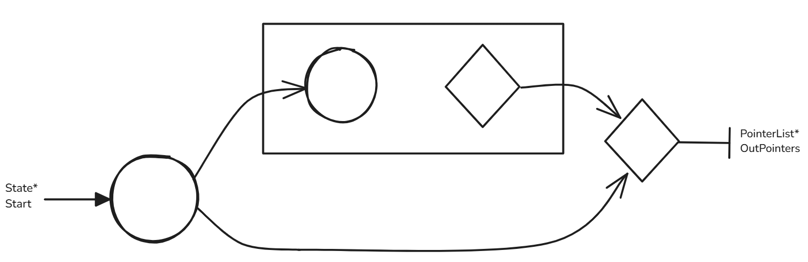

# Introduction

The first step in building a compiler would be to build a lexical analyzer, shortened to 'lexer'. To define what a lexer does we may understand it as a function:

$$\text{Lexer :: string} \to [\text{token}]$$

Where a token can be thought of as the tuple $\text{token} = \langle \text{class, string} \rangle$. A token class, loosely speaking, corresponds to a set of strings. For example we may class strings as identifier tokens, integer tokens, keyword tokens or whitespace tokens.

Concretely, the lexical analyzer does this in two steps:

1. Recognize substrings corresponding to token classes, called lexemes

2. Tag token class corresponding to each lexeme to obtain $\langle$token class, lexeme$\rangle$

We must now contend with what a 'set of strings' that a token may 'accept' means. To concretely define these, we turn to automata theory:

# Automata Theory

## Finite automaton

To model a simple computer with an extremely small amount of memory, only constrained to describing what state it is in, we use finite automata. It is a 5-tuple:

$$M := \left(Q,\Sigma,\delta,q_0,F\right)$$

Where:

1. $Q$ is the set of states.

2. $\Sigma$ is the alphabet.

3. $\delta: Q \times \Sigma \to Q$ is the transition function.

4. $q_0 \in Q$ is the start state.

5. $F \subseteq Q$ is the set of final/accept states.

## Regular language

Associated with this, we can describe the language that $M$ recognizes. To do so, we can define a string $S = s_1 s_2 \text{ ... } s_n$ where each $s_i \in \Sigma$. We say $M$ accepts $S$ if $\exists \lbrace r_i \rbrace_{i = 0,1 \text{ ... } n} \in Q$ such that:

1. $r_0 = q_0$

2. $\delta(r_i,s_{i+1}) = r_{i+1}$

3. $r_n \in F$

In this way, we can define the language recognized by $M$ as the set:

$$L(M) := \lbrace S \medspace | \medspace M \text{ accepts } S \rbrace$$

A regular language $L$ is such that $\exists M$ that recognizes it.

## Regular Operations

Consider two languages $A$ and $B$. We define:

$$\text{Union: } A \cup B = \lbrace x \medspace | \medspace x \in A \lor x \in B \rbrace$$
$$\text{Concatenation: } A \circ B = \lbrace xy \medspace | \medspace x \in A \land y \in B \rbrace$$
$$\text{Kleene star: } A^* = \lbrace x_1x_2\text{ ... } x_k \medspace | \medspace k \ge 0, x_i \in A \medspace \forall i \rbrace$$

## Non-deterministic finite automata

Non-deterministic finite automata (NFA) are a broader class than deterministic finite automata (DFA). It is a 5-tuple:

$$N := \left(Q,\Sigma,\delta,q_0,F\right)$$

Where:

1. $Q$ is the finite set of states.

2. $\Sigma$ is the finite alphabet.

3. $\delta: Q \times \Sigma_{\varepsilon} \to \mathcal{P}(Q)$ is the transition function, where $\Sigma_{\varepsilon} := \Sigma \cup \lbrace \varepsilon \rbrace$.

4. $q_0 \in Q$ is the start state.

5. $F \subseteq Q$ is the set of final/accept states.

Take a string $S = s_1s_2 \text{ ... } s_n$ over the alphabet $\Sigma$. We say $N$ accepts $S$ if we can write $S$ as $S_\varepsilon = s^\varepsilon_1s^\varepsilon_2 \text{ ... } s^\varepsilon_k$ where each $s^\varepsilon_i \in \Sigma_{\varepsilon}$ and $\exists \lbrace r_i \rbrace_{i = 0,1 \text{ ... } k} \in Q$ such that:

1. $r_0 = q_0$

2. $r_{i+1} \in \delta(r_i,s^\varepsilon_{i+1})$

3. $r_k \in F$

## Equivalent DFA for an NFA

Every nondeterministic finite automaton has an equivalent deterministic finite automaton.

For NFA $N := \left(Q,\Sigma,\delta,q_0,F\right)$ we want to construct DFA $M := \left(Q',\Sigma,\delta',q_0',F'\right)$. The idea is simple: we make a DFA over the power set of $Q$. That is:

1. Take $Q' = \mathcal{P}(Q)$

2. In terms of the transition function $\delta'$, for some $s \in \Sigma$ state $r' \in Q'$ we may attempt to take:

$$\delta'(r', s) = \bigcup_{r \in r'} \delta(r, s)$$

This however does not account for states that can be reached with the empty symbol $\varepsilon$. To do so, we first define the function $E : Q' \to Q'$ such that for some state $R \in Q'$:

$$E(R) := \lbrace q \in Q \medspace|\medspace q \text{ can be reached from } R \text{ with 0 or more } \varepsilon \rbrace$$

Then we can write 

$$\delta'(r', s) = \bigcup_{r \in r'} E(\delta(r, s))$$

3. To keep with the definition of $Q'$ and $\delta'$ we may attempt to take $q_0' = \lbrace q_0 \rbrace$. However this in itself is not enough. We need to account for states that can be reached with 0 or more $\varepsilon$ from $q_0$. Therefore,

$$q_0' = E(\lbrace q_0 \rbrace)$$

4. We take the set of accept states $F'$ to be the set of all subsets of $Q$ that contain an accept state. That is:

$$F' = \lbrace r' \in Q' \medspace | \medspace \exists q \in r' \text{ s.t. } q \in F \rbrace$$

A corollary is that:

A language $L$ is regular $\iff$ $\exists$ an NFA that recognizes $L$

$\implies$

If $L$ is regular $\exists$ DFA $M$ that recognizes it. Trivially, a DFA is an NFA and hence the implication is true.

$\impliedby$

If an NFA recognizes $L$ by the prior proof we can construct a DFA that will also recognize $L$. Hence we have that by definition $L$ is regular.


## Closure of regular languages under regular operations

We will show that regular languages are closed under regular operations. That is, if $L_1$ and $L_2$ are regular languages:

$L_1 \cup L_2$ is a regular language.

We have that if $L_1$ and $L_2$ are regular $\exists$ NFA's $N_1 := \left(Q_1,\Sigma,\delta_1,q_1,F_1\right)$ and $N_2 := \left(Q_2,\Sigma,\delta_2,q_2,F_2\right)$ that recognize $L_1$ and $L_2$ respectively

To show regularity of $L_1 \cup L_2$ we construct a new NFA $N = \left(Q,\Sigma,\delta,q_0,F\right)$

1. We introduce a new start symbol $q_0$

2. The set of states $Q := {q_0} \cup Q_1 \cup Q_2$

3. $N$ should accept anything accepted by $N_1$ or $N_2$. Hence we have the set of accept states $F = F_1 \cup F_2$

4. Now we design the transition function $\delta$. Take for any state $q \in Q$ and $\alpha \in \Sigma_\varepsilon$

$$
\delta(q,\alpha) = \begin{cases}
    \delta_1(q,\alpha) \quad q \in Q_1  \\\
    \delta_2(q,\alpha) \quad q \in Q_2  \\\
    \lbrace q_1,q_1 \rbrace \quad  q = q_0 \land \alpha = \varepsilon  \\\
    \emptyset \quad \quad \quad q = q_0 \land \alpha \neq \varepsilon
\end{cases}
$$


Hence we have a new NFA $N$ that recognizes $L_1 \cup L_2$. Therefore we have that $L_1 \cup L_2$ is a regular language.

$L_1 \circ L_2$ is a regular language.

To show regularity of $L_1 \circ L_2$ we construct a new NFA $N = \left(Q,\Sigma,\delta,q_1,F_2\right)$

1. We take $Q = Q_1 \cup Q_2$

2. All we need now is a way to design a transition function such that $N$ can process a string like $N_1$ would till it reaches an accept state in $N_1$, after which we process it like $N_2$ would till we reach an accept state in $N_2$. That is:

$$\delta(q,\alpha) = \begin{cases}
    \delta_1(q,\alpha) \quad \quad \quad \quad q \in Q_1 \land q \notin F_1 \\\
    \delta_1(q,\alpha) \cup \lbrace q_2 \rbrace \quad q \in F_1 \land \alpha = \varepsilon \\\
    \delta_1(q,\alpha) \quad \quad \quad \quad q \in F_1 \land \alpha \neq \varepsilon \\\
    \delta_2(q,\alpha) \quad \quad \quad \quad q \in Q_2
\end{cases}$$


Hence we have a new NFA $N$ that recognizes $L_1 \circ L_2$. Therefore we have that $L_1 \circ L_2$ is a regular language.

$L_1^*$ is a regular language.

To show regularity of $L_1^*$ we construct a new NFA $N = \left(Q,\Sigma,\delta,q_0,F\right)$.

1. Let $q_0$ be a new start symbol.

2. Let $Q = \lbrace q_0 \rbrace \cup Q_1$

3. Take $F = \lbrace q_0 \rbrace \cup F_1$

4. We now want to write a transition function such that we process strings like $N_1$ would till we hit an accept state, at which point we employ an $\varepsilon$ to attempt processing a new string:

$$\delta(q,\alpha) = \begin{cases}
    \delta_1(q,\alpha) \quad \quad \quad q \in Q_1 \land q \notin F_1 \\\
    \delta_1(q,\alpha) \cup \{q_1\} \quad q \in F_1 \land \alpha = \varepsilon \\\
    \delta_1(q,\alpha) \quad \quad \quad q \in F_1 \land \alpha \neq \varepsilon \\\
    \{q_1\} \quad \quad \quad \quad \quad q = q_0 \land \alpha = \varepsilon \\\
    \emptyset \quad \quad \quad \quad \quad  q = q_0 \land \alpha \neq \varepsilon
\end{cases}$$

## Regular expressions

Regular expressions are expressions used to represent languages. Defined as:

$R$ is a regular expression if $R$ is:

1. $\alpha$ (representing the language $\lbrace \alpha \rbrace$) for $\alpha \in \Sigma$

2. $\varepsilon$ (representing the language $\lbrace \varepsilon \rbrace$) where $\varepsilon$ is the empty string.

3. $\emptyset$ representing the empty language.

4. $R_1 \cup R_2$ where $R_1$ and $R_2$ are regular expressions

5. $R_1 \circ R_2$ where $R_1$ and $R_2$ are regular expressions

6. $R_1^*$ where $R_1$ is a regular expression


Suppose we have regular expressions $R_1$ and $R_2$, and say some sequence $a_i \in \Sigma$. We introduce the shorthand:

1. $R_1 | R_2 = R_1 \cup R_2$

2. $R_1 R_2 = R_1 \circ R_2$

3. $R_1+ = R_1 \circ R_1^*$

4. $R_1? = R_1 \cup \varepsilon$

5. $[a_1a_2 \text{ ... } a_n] = a_1 \cup a_2 \cup \text{ ... } \cup a_n$

We can show that regular languages are equivalent to NFA's. To do so, we employ the McNaughton–Yamada–Thompson algorithm.

## McNaughton–Yamada–Thompson algorithm

Using this algorithm we can construct an NFA from an input regular expression.

Input: $R$ is a regular expression over some alphabet $\Sigma$

Output: NFA $N$ that accepts the language $L(R)$

Procedure:

We process $R$ by its definition. Suppose:

1. $R = \alpha$ for some $\alpha \in \Sigma$. Introduce start state $P$ and accept state $Q$. We take $N(R)$ as:


2. $R = R_1 | R_2$ for some regular expressions $R_1$ and $R_2$. Suppose we have built NFA's $N(R_1)$ and $N(R_2)$. Introduce start state $P$ and accept state $Q$. We take $N(R)$ as:


3. $R = R_1 R_2$ for some regular expressions $R_1$ and $R_2$. Suppose we have built NFA's $N(R_1)$ and $N(R_2)$. Introduce start state $P$. We take the accept states of $N(R)$ as the accept states of $N(R_2)$. We design $N(R)$ as:


4. $R = R_1^*$ for some regular expression $R_1$. Suppose we have built the NFA $N(R_1)$. Introduce start state $P$ and accept state $Q$. We design $N(R)$ as:


# Implementing a regular expression matching program

The below implementation is inspired by [this](https://swtch.com/~rsc/regexp/regexp1.html) article from Russ Cox. All code is written in C and can be found on my [GitHub](https://github.com/AbhinavPradeep/RegexMatching). To say that a string matches a regular expression $R$ is equivalent to saying that it is accepted by the NFA equivalent to $R$. Hence one strategy to match a string to a regular expression is to construct an NFA equivalent to the expression, and then simulate it for any given string input.

To generate the NFA from a regular expression, we employ McNaughton–Yamada–Thompson algorithm. As a result of this construction, we have the property any state can have at most two outgoing transitions: either one transition for some $\alpha \in \Sigma$, or two $\varepsilon$ transitions. Hence, we can define the struct for a state as:


```C
typedef struct state State;
struct state {
    int Symbol;
    State* Transition1;  
    State* Transition2;
    // For checking StateSetList membership
    int Mark;
};
```

As per the comment the Mark is used to check set membership when simulating the NFA. Symbol has allowed values between 32-255 inclusive (all the printable ASCII characters) alongside the additional values:

```C
enum
{
    // We take 256 to denote a Match state.
    Match = 256,
    // We take 257 to denote a Split state.
    Split = 257
};
```

In this manner, the Symbol field is used to dictate the number of transitions and the alphabet to transition on: if Symbol $\in[32,255]$ the state has one outgoing transition on the value of Symbol, if Symbol is equal to Split (257) then the state has two outgoing $\varepsilon$-transitions, and if Symbol is equal to Match (256) it is the accepting state and has no outgoing transitions. This can be visualized as:


As evident from the algorithm we also need some way to represent the NFA's formed by the subexpressions of the input regular expression. To do so, we define the SubExpression struct:

```C
typedef struct sub SubExpression;
struct sub {
    State* Start;
    // Out pointers of the accept states in the fragment
    PointerList* OutPointers;
};
```
We may have more than one accept state in the sub-expression by the nature of the implementation. For example, as will be later evident, in our implementation we can have a sub-expression $a|b$ looking like:


Hence we store pointers to the out pointers of the accept states in a pointer list defined as:

```C
typedef struct ptrlist PointerList;
struct ptrlist {
    State** CurrentPointer;
    PointerList* NextPointer;
};
```

That is, PointerList is a linked list where each node stores a pointer to a State pointer and a pointer to the next node. Now we write some simple helper functions:

```C
State* CreateState(int Symbol, State* Transition1, State* Transition2) {
    State* NewState = malloc(sizeof(State));
    NewState->Symbol = Symbol;
    NewState->Transition1 = Transition1;
    NewState->Transition2 = Transition2;
    return NewState;
}

SubExpression CreateSubExpression(State* Start, PointerList* OutPointers)
{
    SubExpression New;
    New.Start = Start;
    New.OutPointers = OutPointers;
    return New;
}
```

As is evident, we keep the SubExpressions on the stack. This is because we constantly create, merge and destroy them in the algorithm. Hence heap operations of allocating and deallocating them constantly would be expensive. Next we write a function ConnectAutomata to connect two automata:

```C
void ConnectAutomata(PointerList* OutPointers, State* Start)
{
    PointerList* Next;
    while (OutPointers != NULL) {
        Next = OutPointers->NextPointer;
        *(OutPointers->CurrentPointer) = Start;
        OutPointers = Next;
    }

}
```

ConnectAutomata will make all the out pointers of the accepts states of an NFA, stored in PointerList* OutPointers, point to the state pointed to by State* Start. 

Now suppose we wish to take a union of two NFAs $N_1$ and $N_2$. In doing so, every accept state of $N_1$ is an accept state of $N_2$. Hence we need a way to combine the out pointers of the two automata, and so we write function AppendOutPointers:

```C
PointerList* AppendOutPointers(PointerList* OutPointers, PointerList* MoreOutPointers)
{
    if (OutPointers == NULL) {
        return MoreOutPointers;
    }
	PointerList* NewOutPointers = OutPointers;
    while (OutPointers->NextPointer != NULL)
    {
        OutPointers = OutPointers->NextPointer;
    }
    OutPointers->NextPointer = MoreOutPointers;
    return NewOutPointers;

}
```

Which simply appends the two linked lists. Now we can focus on each sub-step of the McNaughton–Yamada–Thompson algorithm:

## Sub-steps of McNaughton–Yamada–Thompson algorithm:

### Handling a single character sub-expression

```C
SubExpression CreateSingleCharacter(int Symbol) {
    State* Start = CreateState(Symbol,NULL,NULL);
    PointerList* OutPointer = malloc(sizeof(PointerList));
    OutPointer->CurrentPointer = &(Start->Transition1);
    OutPointer->NextPointer = NULL;
    return CreateSubExpression(Start, OutPointer);
}
```


### Handling a union sub-expression

```C
SubExpression ApplyUnion(SubExpression* NFA1, SubExpression* NFA2) {
    State* NewStart = CreateState(Split, NFA1->Start, NFA2->Start);
    return CreateSubExpression(NewStart, AppendOutPointers(NFA1->OutPointers, NFA2->OutPointers));
}
```


### Handling a concatenation sub-expression

```C
SubExpression ApplyConcatenation(SubExpression* NFA1, SubExpression* NFA2) {
    ConnectAutomata(NFA1->OutPointers, NFA2->Start);
    return CreateSubExpression(NFA1->Start, NFA2->OutPointers);
}
```


### Handling a Kleene star sub-expression

```C
SubExpression ApplyKleeneStar(SubExpression* NFA) {
    State* NewStart = CreateState(Split, NFA->Start, NULL);
    ConnectAutomata(NFA->OutPointers, NewStart);
    // Make a new PointerList with just NewStart->Transition2
    PointerList* NewOutPointers = malloc(sizeof(PointerList));
    NewOutPointers->CurrentPointer = &(NewStart->Transition2);
    NewOutPointers->NextPointer = NULL;
    return CreateSubExpression(NewStart,NewOutPointers);
}
```


### Handling a one-or-more sub-expression

```C
SubExpression ApplyOneOrMore(SubExpression* NFA) {
    State* NewSplit = CreateState(Split, NFA->Start, NULL);
    ConnectAutomata(NFA->OutPointers, NewSplit);
    // Make a new PointerList with just NewSplit->Transition2
    PointerList* NewOutPointers = malloc(sizeof(PointerList));
    NewOutPointers->CurrentPointer = &(NewSplit->Transition2);
    NewOutPointers->NextPointer = NULL;
    return CreateSubExpression(NFA->Start,NewOutPointers);
}
```


### Handling a zero-or-one sub-expression

```C
SubExpression ApplyZeroOrOne(SubExpression* NFA) {
    State* NewStart = CreateState(Split, NFA->Start, NULL);
    PointerList* NewOutPointer = malloc(sizeof(PointerList));
    NewOutPointer->CurrentPointer = &(NewStart->Transition2);
    NewOutPointer->NextPointer = NULL;
    return CreateSubExpression(NewStart,AppendOutPointers(NFA->OutPointers,NewOutPointer));
}
```



## Putting it together

We now write the complete algorithm. For simplicity, we will assume that the regular expression is in postfix form. This will allow us to parse through it very efficiently using a stack. The implementation uses a statically sized stack as the expressions we will be testing the code on are not enormously complex. Given below is the code:

```C
SubExpression GenerateNFA(char* Regex) {
    SubExpression Stack[1000];
    SubExpression* StackPointer = Stack;
    SubExpression E1, E2, E;
    char* Symbol = Regex;

    #define push(s) (*StackPointer++ = s)
    #define pop() (*--StackPointer)
    
    while (*Symbol != '\0')
    {
        
        if (*Symbol == '.')
        {
            // Concatenate
            E2 = pop();
            E1 = pop();
            E = ApplyConcatenation(&E1, &E2);
            push(E);
        } else if (*Symbol == '|') {
            // Union
            E1 = pop();
            E2 = pop();
            E = ApplyUnion(&E1, &E2);
            push(E);
        } else if (*Symbol == '*') {
            // Kleene star
            E = pop();
            E = ApplyKleeneStar(&E);
            push(E);
        } else if (*Symbol == '+') {
            // One or more
            E = pop();
            E = ApplyOneOrMore(&E);
            push(E);
        } else if (*Symbol == '?') {
            // Zero or one
            E = pop();
            E = ApplyZeroOrOne(&E);
            push(E);
        } else if (*Symbol >= 32 && *Symbol <= 255) {
            // Any printable ASCII character should 
            // become a single state
            E = CreateSingleCharacter(*Symbol);
            push(E);
        } else {
            // Weird symbol
            fprintf(stderr, "Invalid symbol '%c' in regex.\n", *Symbol);
            exit(1);
        }
        // Continue reading string
        Symbol++;
    }

    // If your stack size is not 1, then something went wrong.
    if (StackPointer - Stack != 1) {
        fprintf(stderr, "Something went wrong, stack has %d items left.\n", StackPointer - Stack);
        exit(1);
    }

    E = pop();
    // Connect all out pointers of the final automata to a Match state
    State* MatchState = CreateState(Match, NULL, NULL);
    ConnectAutomata(E.OutPointers, MatchState);
    return E;
}
```
Now we must deal with simulating the generated NFA on an input string.

## Simulating an NFA

The algorithm to simulate an NFA is fairly simple:

Input: We are given a string $S = s_1s_2s_3 ... s_n$ and NFA $N$

Output: Whether $S \in L(N)$

Set up: Suppose we have two sets CurrentSet and NextSet. Suppose we have a function 

$$\varepsilon\text{-closure} : Q \to \mathcal{P}(Q)$$

that takes any set in $q \in Q$ and returns the set of all states that can be reached in zero or more $\varepsilon$-transitions. The notation $q \stackrel{s}{\to} q' \medspace$ is to say $q$ transitions to $q'$ on $s$. 

Procedure:

1. CurrentSet $\gets$ $\varepsilon$-closure(N.start)

2. For each character $s \in S$

    a. NextSet $\gets \emptyset$

    b. For each $q \in$ CurrentSet, if $q \stackrel{s}{\to} q' \medspace$ : $\medspace \text{NextSet } \gets \text{NextSet } \cup \varepsilon\text{-closure}(q')$

    c. Swap CurrentSet and NextSet

3. Return true if CurrentSet has the Match state.

Suppose we have regular expression $R$ with $\|R\|$ number of operands and operators, and a string $S$ with $\|S\|$ number of characters. Take $\|Q\|$ is the number of states and $\|\Delta \|$ are the number of transitions in NFA generated from $R$. We can analyze as below:

1. We loop over all $\|S\|$ characters of $S$. At each iteration, we loop over every state in CurrentSet and compute the $\varepsilon\text{-closure}$ of all appropriate transitions. So we know we have a term $\mathcal{O}(\medspace \|S\| \times f(\|Q\|, \|\Delta\|) \medspace)$. We now where $f$ is the time complexity of computing the $\varepsilon\text{-closure}$ of every valid state in CurrentSet in the worst case.

2. We may bound computing the $\varepsilon\text{-closure} \in \mathcal{O}(\| \Delta \|)$ worst case. We may bound iterating over over every state in CurrentSet in $\mathcal{O}(\| Q \|)$. It may appear that step 2 b. would therefore be $\mathcal{O}(\| \Delta \| \times \| Q \|)$. However this can circumvented by clever use of marking states: ensuring that each state and each transition is processed only once per input symbol. Therefore, we can reduce the bound to: $\mathcal{O}(\| \Delta \| + \| Q \|)$

3. Hence we can write the time complexity of the algorithm as: 

$$\underbrace{\mathcal{O}(\| \Delta \|)}_{\varepsilon\text{-closure(N.start)}} + \mathcal{O} (\|S\| \times ( \| \Delta \| + \| Q \|)) \subseteq \mathcal{O} (\|S\| \times ( \| \Delta \| + \| Q \|))$$

4. As the NFA is generated by the McNaughton–Yamada–Thompson algorithm we know that each state can have at most two outgoing transitions, and (observe the diagrams attached with the algorithm) that there are at most twice as many states as operators and operands in $R$. That is we have: $\|Q\| \le 2\|R\|$ and $\|\Delta\| \le 4\|R\|$. This implies that $\mathcal{O}(\| \Delta \| + \| Q \|) \subseteq \mathcal{O}(\| R \|)$. Hence we can write:

$$\mathcal{O} (\|S\| \times ( \| \Delta \| + \| Q \|)) \subseteq \mathcal{O} (\|S\| \times \|R\| )$$

Therefore analysis on this algorithm yields a time complexity of $\mathcal{O} ( \|S\| \times \|R\| )$. For a fixed regular expression $R$, we have that simulating an NFA to check for acceptance is linear in the size of the input string $S$, which is efficient as long as $\|R\|$ is relatively small.

To implement this in code we would need a struct to represent a set. To avoid dealing with hashing, we may write a simple array-based set:

```C
typedef struct ssl StateSetList;
struct ssl
{
    // For simplicity we keep a statically sized
    // container.
    State* States[MAX_SIZE];
    int Size;
};
```

Introduce a variable:

```C
// For marking StateSetList membership
static int Generation = 0;
```

The marking strategy is simple: Generation is incremented each time any character is processed. When we insert a State into a StateSetList we set State's Mark field to Generation. Hence, we can write:

```C
void Add(StateSetList* Set, State* S) {
    if (S == NULL || S->Mark == Generation) {
        return;
    }
    S->Mark = Generation;
    //Ensure you do $\varepsilon$-closure
    if(S->Symbol == Split) {
        Add(Set, S->Transition1);
        Add(Set, S->Transition2);
        return;
    }
    Set->States[Set->Size] = S;
    Set->Size++;
}
```

Here Add ensures that S is not processed if S->Mark == Generation. That is: we do not add the $\varepsilon\text{-closure}$(S) to States if it has already been added this generation. In this way we achieve the $\mathcal{O}(\|Q\| + \|\Delta\|)$ bound for processing CurrentSet.

Now we need a function that will step through the NFA. That is, we need to iterate through every state in CurrentSet. Remember that a State's Symbol field dictates how/on what character it transitions. Therefore, we iterate through every state S in CurrentSet, checking the S->Symbol field, and calling Add on S->Transition1 if appropriate. In doing so, we enforce the precondition that CurrentSet has no Split states. This is guaranteed as we use Add to update the sets, and it ensures that  $\varepsilon$-closure is done.

```C
void StepThroughNFA(StateSetList* CurrentSet, StateSetList* NextSet, int Symbol) {
    Generation++;
    State* S;
    NextSet->Size = 0;
    for(int i = 0; i < CurrentSet->Size; i++) {
        S = CurrentSet->States[i];
        if(S->Symbol == Symbol) {
            // Will never have Split states as Add 
            // always ensures that $\varepsilon$-closure is done
            Add(NextSet, S->Transition1);
        }
    }
}
```

We need one last helper function:

```C
int SetContainsMatch(StateSetList* Set) {
    for(int i = 0; i < Set->Size; i++) {
        if((Set->States[i])->Symbol == Match) {
            return 1;
        }
    }
    return 0;
}
```

Which simply iterates thought the StateSetList to check if it contains the Match state.

Hence we can write the complete algorithm as:

```C
int MatchesRegex(SubExpression ThompsonNFA, char* StringToCheck) {
    StateSetList CurrentSet, NextSet;
    CurrentSet.Size = 0;
    Generation++;
    Add(&CurrentSet, ThompsonNFA.Start);
    NextSet.Size = 0;

    for (char* SymbolPointer = StringToCheck; *SymbolPointer != '\0'; SymbolPointer++) {
        StepThroughNFA(&CurrentSet, &NextSet, *SymbolPointer);
        StateSetList Temp = CurrentSet;
        CurrentSet = NextSet;
        NextSet = Temp;
    }
    return SetContainsMatch(&CurrentSet);
}
```

# Testing the program

## Visualizing the NFA's generated

To visualize the NFA generated, we print it out as a .dot file and use Graphviz through a Python script to generate the below images.

First we visualize the basic automaton generated:

### a


### a|b


### ab


### a*


### a+


### a?


And now we can see how more complex regular expressions are handled:

### abab|abbb

In postfix form: ab.ab..ab.bb..|


### abab|(abbb)+

In postfix form: ab.ab..ab.bb..+|


### (a?)\*|b 

In postfix form: a?*b|


### (a\*b\*)|(a+b+) 

In postfix form: a\*b\*.a+b+.|


## Checking regular expression matching

We write a simple test as: 

```C
int main() {
    // ((ab)|c)*
    char* Regex = "ab.c|*";
    SubExpression NFA = GenerateNFA(Regex);
    char* Test[7] = {
        "abc",  // YES
        "ac",   // NO
        "a",    // NO
        "b",    // NO
        "aa",   // NO
        "cab",  // YES
        ""      // YES
    };

    printf("Regex: \"%s\" \n", Regex);

    for (int i = 0; i < 7; i++) {
        char* S = Test[i];
        int Result = MatchesRegex(NFA, S);
        printf("String: \"%s\", Matches: %s\n", S, Result ? "YES" : "NO");
    }

    return 0;
}
```

The generated NFA looks like:


And the outcome we get is: 

```Shell
Regex: "ab.c|*" 
String: "abc", Matches: YES
String: "ac", Matches: NO
String: "a", Matches: NO
String: "b", Matches: NO
String: "aa", Matches: NO
String: "cab", Matches: YES
String: "", Matches: YES
```

In terms of performance, we see the linear scaling of the algorithm as below:


# How does this tie into writing a lexical analyzer?

If we specify a token in terms of a regular expression, we now have a way to concretely define the 'set of strings' that a token may 'accept'. For example, we may take:

```Shell
Variable: [A-Za-z][A-Za-z0-9]*
Number: [0-9]+(\.[0-9]+)?(E[+-]?[0-9]+)?
```

This means, we take a Variable token to be a string that starts with a lower or upper case letter, followed by zero or more lower or upper case letters or numbers. We take a Number token to be a string starting with one or more digits, followed by an optional decimal part, and an optional exponent.

Moreover, through the McNaughton–Yamada–Thompson algorithm we can construct an NFA from these regular expressions. As was have seen, it can then be determined if a string is accepted by the generated NFA in linear time. This therefore offers an avenue to tokenize text efficiently, and is therefore crucial to building a lexer.