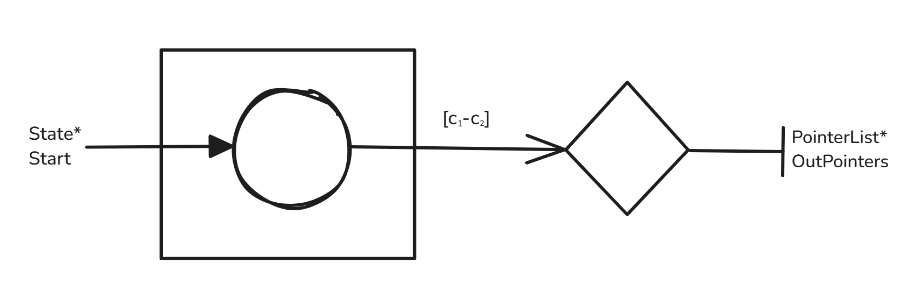
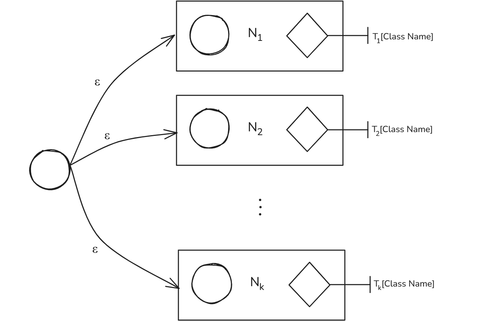

# Extending the NFA generator

[Previously](https://abhinavpradeep.com/blog/compiler-1/) we implemented a regular expression matching algorithm that generated an NFA from an input regular expression, and simulated a string over the NFA to check for acceptance. The regular expression was required to be in postfix form and the algorithm only supported union $|$ , concatenation $.$ , Kleene star $\*$ , one-or-more $+$ , and zero-or-one $?$ operations. While this was sufficient for simple applications, building a lexer would require support for character ranges (for example $[0\text{-}9]$, $[a\text{-}z]$) and escape characters (for example one may wish to use $\*$ for the multiply operator rather than Kleene star).

To support the character range, we modify the state struct as below:

```C
struct state {
    int SymbolRangeStart;
    int SymbolRangeEnd;
    State* Transition1;  
    State* Transition2;
    // For checking StateSetList membership
    int Mark;
    char* TokenClass;
};
```

Note that we have now also added the TokenClass field. Only a Match state will have this field populated. It will hold the token associated with the regular expression.

If the state transitions on a single character $c$ we may just set SymbolRangeStart and SymbolRangeEnd to $c$. We write a helper function to handle state transition logic in a centralized fashion:

```C
bool CheckStateOut(int Symbol, State* State) {
    return (Symbol >= State->SymbolRangeStart && Symbol <= State->SymbolRangeEnd);
}
```

Next we introduce a function to create a sub-expression for a state that transitions on a character range $[c_1\text{-}c_2]$:

```C
SubExpression CreateRange(int StartSymbol, int EndSymbol) {
    State* Start = CreateState(StartSymbol, EndSymbol, NULL, NULL);
    PointerList* OutPointer = malloc(sizeof(PointerList));
    //printf("Allocated PointerList at %p\n", (void*)OutPointer);
    OutPointer->CurrentPointer = &(Start->Transition1);
    OutPointer->NextPointer = NULL;
    return CreateSubExpression(Start, OutPointer);
}
```

Graphically:



Now we wish to be able to parse and error handle for substrings of the form $[c_1\text{-}c_2]$. For our purposes we need to write a helper function to ensure that can parse a substring $c_1\text{-}c_2]$ as below:

```C
bool ParseCharacterRange(char** S, int* SymbolRange) {
    // Check if we are a valid character and 
    // if the next character is '-'
    if(!(**S >= 32 && **S <= 255 && *(*S+1) == '-')) return false;
    SymbolRange[0] = **S;
    *S+=2;
    // Check if we are a valid character and 
    // if the next character is ']'
    if(!(**S >= 32 && **S <= 255 && *(*S+1) == ']')) return false;
    SymbolRange[1] = **S;
    *S+=1;
    return true;
}
```

Which checks for correct formatting, and if the regular expression is specified correctly it populates int* SymbolRange with the extracted range. 

Now we update the GenerateNFA function. We include a section that checks for the opening bracket of a range '[', and on finding it validates the rest of the pattern while parsing for the bounds. We then include a section which checks for the literal '\\' (which is '\\\\' in ascii). On finding it, we ensure that if we have encountered new-line or tab characters we insert them into the state correctly. If we have encountered an escaped character we handle that as necessary. Below is the code:

```C
SubExpression GenerateNFA(char* Regex, char* TokenClass) {
    SubExpression Stack[1000];
    SubExpression* StackPointer = Stack;
    SubExpression E1, E2, E;
    int SymbolRange[2]  = {0, 0};
    char* Symbol = Regex;

    #define push(s) (*StackPointer++ = s)
    #define pop() (*--StackPointer)
    
    while (*Symbol != '\0')
    {
        
        if (*Symbol == '.')
        {
            // Concatenate
            E2 = pop();
            E1 = pop();
            E = ApplyConcatenation(&E1, &E2);
            push(E);
        } else if (*Symbol == '|') {
            E1 = pop();
            E2 = pop();
            E = ApplyUnion(&E1, &E2);
            push(E);
            // Union
        } else if (*Symbol == '*') {
            // Kleene star
            E = pop();
            E = ApplyKleeneStar(&E);
            push(E);
        } else if (*Symbol == '+') {
            // One or more
            E = pop();
            E = ApplyOneOrMore(&E);
            push(E);
        } else if (*Symbol == '?') {
            // Zero or one
            E = pop();
            E = ApplyZeroOrOne(&E);
            push(E);
        } else if (*Symbol == '\\') {
            // If we encounter an escape
            // Ensure we do not end up misinterpreting
            // the newline and tab special characters
            Symbol++;
            if (*Symbol == 't') {
                E = CreateSingleCharacter('\t');
                push(E);
            } else if (*Symbol == 'n') {
                E = CreateSingleCharacter('\n');
                push(E);
            } else if (*Symbol == 'r') {
                E = CreateSingleCharacter('\r');
                push(E);
            } else if (*Symbol >= 32 && *Symbol <= 255) {
                // Any printable ASCII character should 
                // become a single state
                E = CreateSingleCharacter(*Symbol);
                push(E);
            } else {
                // Weird symbol
                fprintf(stderr, "Invalid symbol '%c' in regex.\n", *Symbol);
                exit(1);
            }
        } else if (*Symbol == '[') {
            Symbol++;
            // Ensure pattern matches "(start)-(end)]"
            if (ParseCharacterRange(&Symbol, SymbolRange)) {
                //fprintf(stderr, "At %c \n", *Symbol);
                E = CreateRange(SymbolRange[0], SymbolRange[1]);
                push(E);
            } else {
                fprintf(stderr, "Character range was specified incorrectly.");
                exit(1);
            }
        } else if (*Symbol >= 32 && *Symbol <= 255) {
            // Any printable ASCII character should 
            // become a single state
            E = CreateSingleCharacter(*Symbol);
            push(E);
        } else {
            // Weird symbol
            fprintf(stderr, "Invalid symbol '%c' in regex.\n", *Symbol);
            exit(1);
        }
        // Continue reading string
        Symbol++;
    }

    // If your stack size is not 1, then something went wrong.
    if (StackPointer - Stack != 1) {
        fprintf(stderr, "Something went wrong, stack has %ld items left.\n", StackPointer - Stack);
        exit(1);
    }

    E = pop();
    State* MatchState = CreateState(Match, Match, NULL, NULL);
    MatchState->TokenClass = strdup(TokenClass);
    ConnectAutomata(E.OutPointers, MatchState);
    // return pop();
    return E;
}
```

In doing so, we are able to parse more complex regular expressions. Writing an appropriate main function (to create an executable Match \<regex\> \<string\>) we can generate some examples of the pattern matching. Below we pattern match against the regex $[0\text{-}9][\text{A-Z}]^*$ (in postfix with explicit concatenation this is [0-9][A-Z]\*.). That is, the input string must start with a number and have zero or more capitalized letters:

```shell
apradeep@Lucy:~/Dev/RegexMatch$ ./Match '[0-9][A-Z]*.' '1ABC'
Regex: "[0-9][A-Z]*."
Test String: "1ABC"
Matches: YES
apradeep@Lucy:~/Dev/RegexMatch$ ./Match '[0-9][A-Z]*.' '1'
Regex: "[0-9][A-Z]*."
Test String: "1"
Matches: YES
apradeep@Lucy:~/Dev/RegexMatch$ ./Match '[0-9][A-Z]*.' '1abc'
Regex: "[0-9][A-Z]*."
Test String: "1abc"
Matches: NO
```

Now when building the lexer we may easily specify tokens such as:

```
IDENTIFIER:[A-Z][a-z]|[A-Z][a-z]|[0-9]|*.
NUMBER:[0-9]+\.[0-9]+.?.E\+-|?.[0-9]+.?.
PLUS:\+
TIMES:\*
```

# NFA approach to lexical analysis

## Revision

To revise what a lexer does we may understand it as a function:

$$\text{Lexer :: string} \to [\text{Token}]$$

Where a token is the tuple $\text{Token} = \langle \text{Class, String} \rangle$. We specify these classes of tokens as regular expressions. All strings that match the regular expression corresponding to a token are its lexemes.

## Broad Idea

Suppose we are given a list of $k$ tokens $T_i = \langle \text{Class Name, Regular Expression} \rangle$. By our previous work, for each of the $T_i$ we can generate an NFA $N_i$ equivalent to its corresponding regular expression, ensuring to label the NFA's match state with Class Name. For any NFA-based lexical analysis approach we fist construct the below NFA:



That is we introduce a new start state and give it $\varepsilon$-transitions to each of the generated NFA. Therefore to match a string $S$ against this NFA is equivalent to matching it against each of the generated NFA simultaneously. If an accept state in some sub-NFA $N_i$ is reached by running the generated NFA on $S$, we label $S$ with the corresponding $T_i[\text{Class Name}]$. If several are reached, some form of prioritization technique must be utilized.

## Motivating maximal munch

Previously we discovered how to match a string to its corresponding token class. Now we focus on how to do so for substrings of the input string. To motivate the maximal munch algorithm for this task let us consider the example:

```C
if(a==true)
```

As we read the code we know that upon lexing we must achieve the tokenization:

```shell
<KW_IF, 'if'>
<L_PAREN, '('>
<EQUIV, '=='>
<BOOLEAN, 'true'>
<R_PAREN, ')'>
```

Now consider the process of lexing. Say we start processing the string one character at a time. If we pick out lexemes greedily, that is we immediately return a token for the substring when we reach a match state, we would arrive at the tokenization:

```shell
<KW_IF, 'if'>
<L_PAREN, '('>
<EQUALS, '='>
<EQUALS, '='>
<BOOLEAN, 'true'>
<R_PAREN, ')'>
```

Clearly, this is wrong. The '==' is recognized as two 'equals to' signs as compared to an equivalence operator. In situations like this is where maximal munch is superior. The idea behind maximal munch is simple: pick the largest prefix of the input text that matches token. Therefore, in the above example, when maximal munch would encounters '=' it would keep note it has encountered something in the EQUALS class and proceed. On encountering the next '=' it would update itself to keep note that it has encountered '==' which is in the EQUIV class. In this way maximal munch is generally unambiguous. 

But is worthwhile to consider cases maximal munch may fail. An infamous case of this is the C++ declaration:

```C
 std::vector<std::vector<int>> Matrix;
```

Where Matrix is a 2D dynamic array effectively. The compiler would tokenize '>>' as the bit shift as compared to recognizing then as two different '>' brackets. Hence developers were required to use a space as '> >' so that the lexer would work correctly. When using maximal munch, such issues are addressed by adding special cases to the lexer.

## Maximal-Munch Algorithm

Below we will sketch the maximal munch algorithm. The idea of the algorithm is effectively to keep munching input as long as the NFA can transition. When it cannot anymore, we return the token class and position associated with the last accept state we have found, in effect returning the longest prefix which has an associated token class.

Input: We are given a pointer $P$ to the string and NFA $N$ generated from the sub-NFA for each token 

Output: Array $\text{TokenizedText}$ of type $\text{Token}$

1. Initialize:
   - $\text{Start} \gets P$
   - $\text{Forward} \gets P$
   - $\text{TokenizedText} \gets []$
   - $\text{CurrentSet, NextSet} \gets \emptyset$
   - $\text{LastMatchedToken} \gets \text{NULL}$
   - $\text{LastMatchedPosition} \gets \text{NULL}$

2. While $\text{Start} < |P|$ do:
   - $\text{Forward} \gets \text{Start}$
   - $\text{CurrentSet} \gets \varepsilon\text{-closure}(N.\text{start})$
   - $\text{LastMatchedToken} \gets \text{NULL}$
   - $\text{LastMatchedPosition} \gets \text{NULL}$

   - While $\text{Forward} < |P|$ do:
     - $\text{NextSet} \gets \emptyset$
     - $\text{StepThroughNFA}(\text{Forward}, \text{NextSet}, \text{CurrentSet})$ // As described [here](https://abhinavpradeep.com/blog/compiler-1/#simulating-an-nfa)
     - If $\text{NextSet}$ is empty, break the loop
     - For each state $q \in \text{NextSet}$:
       - If $q$ is accepting:
         - $\text{LastMatchedPosition} \gets \text{Forward}$
         - $\text{LastMatchedToken} \gets \text{Token}(q)$
     - $\text{Swap}(\text{CurrentSet}, \text{NextSet})$
     - $\text{Forward} \gets \text{Forward} + 1$
   - If $\text{LastMatchedToken} \neq \text{NULL}$:
     - $\text{TokenizedText}.\text{InsertToken}(\text{Start}, \text{LastMatchedPosition}, \text{LastMatchedToken})$

   - Else:
     - $\text{TokenizedText}.\text{InsertToken}(\text{Start}, \text{Invalid})$

   - $\text{Start} \gets \text{Start} + 1$

3. Return $\text{TokenizedText}$


## Implementation

Our goal is to create an executable that processes a lexical grammar and a file with code as input, returning an array of the tokenized code. We first introduce a Token type and a dynamic array to store tokens:

```C
typedef struct {
    char* Class;
    char* Lexeme;
} Token;

typedef struct {
    Token* Tokens;
    int SizeOfStructure;
    int Number;
} TokenArray;
```

To ensure appends in amortized $O(1^\*)$ time, we ensure appends and resize as below:

```C
#define INITIAL_SIZE_TOK 128

void InitializeTokenArray(TokenArray* Array) {
    Array->Tokens = malloc(INITIAL_SIZE_TOK*sizeof(Token));
    Array->SizeOfStructure = INITIAL_SIZE_TOK;
    Array->Number = 0;
}

void InsertToken(TokenArray* Array, char* Class, char* Start, char* End) {
    // Grow geometrically for amortized O(1*)
    if (Array->SizeOfStructure == Array->Number) {
        Array->SizeOfStructure = Array->SizeOfStructure*2;
        Array->Tokens = realloc(Array->Tokens, Array->SizeOfStructure * sizeof(Token));
    }

    Array->Tokens[Array->Number].Class = strdup(Class);

    int LexemeLength = (End - Start) + 1;
    Array->Tokens[Array->Number].Lexeme = malloc(LexemeLength + 1);
    memcpy(Array->Tokens[Array->Number].Lexeme, Start, LexemeLength);
    Array->Tokens[Array->Number].Lexeme[LexemeLength] = '\0';

    Array->Number++;
}

void FreeTokenArray(TokenArray* Array) {
    for (int i = 0; i < Array->Number; i++) {
        free(Array->Tokens[i].Class);
        free(Array->Tokens[i].Lexeme);
    }
    free(Array->Tokens);
}
```

Now we need a way to represent the new start state. Recall that the state class previously had only two outgoing transitions due to properties of the McNaughton–Yamada–Thompson algorithm. That will not suffice here. Therefore we introduce:

```C
#define INITIAL_SIZE_NFA 32

typedef struct CombinedNFA{
    State** SubNFA;
    int SizeOfStructure;
    int Number;
} CombinedNFA;
```

Which is just a dynamic array of pointers to the start state of each sub-NFA. This structure is processed by parsing the input lexical grammar file as below:

```C
#define MAX_LINE_LENGTH 256

CombinedNFA* ProcessLexicalGrammar(const char* Name) {

    CombinedNFA* NFA = malloc(sizeof(CombinedNFA));

    NFA->SubNFA = malloc(sizeof(State*)*INITIAL_SIZE_NFA);
    NFA->SizeOfStructure = INITIAL_SIZE_NFA;
    NFA->Number = 0;

    FILE* File = fopen(Name, "r");

    if (!File) {
        perror("Error opening file");
        exit(1);
    }

    char Line[MAX_LINE_LENGTH];
    while (fgets(Line, sizeof(Line), File)) {
        char* TokenName = strtok(Line, ":");
        // Continue from where last strtok left off
        char* Regex = strtok(NULL, "\n");

        if (TokenName && Regex) {
            // printf("<Token: %s, Regex: %s>\n", TokenName, Regex);
            SubExpression Sub = GenerateNFA(Regex, TokenName);
            NFA->SubNFA[NFA->Number] = Sub.Start;
        }

        NFA->Number++;

        // Grow geometrically for amortized O(1*)
        if(NFA->Number == NFA->SizeOfStructure) {
            NFA->SizeOfStructure = NFA->SizeOfStructure*2;
            NFA->SubNFA = realloc(NFA->SubNFA, sizeof(State*)*NFA->SizeOfStructure);
        }
    }

    fclose(File);

    return NFA;
}
```

Therefore, we can generate the NFA for lexical analysis from an input lexical grammar. Now we focus on implementing the maximal munch algorithm itself:

```C
TokenArray* TokenizeText(CombinedNFA* NFA, char* Text) {
    char* Start = Text;
    char* Forward;
    
    TokenArray* TokenizedText = malloc(sizeof(TokenArray));
    InitializeTokenArray(TokenizedText);
    StateSetList CurrentSet, NextSet;

    // Pre-compute \varepsilon-closure of start.
    StateSetList InitialSet;
    InitialSet.Size = 0;
    Generation++;
    for (int i = 0; i < NFA->Number; i++) {
        Add(&InitialSet, NFA->SubNFA[i]);
    }

    char* LastMatchedToken;
    char* LastMatchedPosition;
    
    while (*Start != '\0')
    {
        Forward = Start;
        
        LastMatchedToken = NULL;
        LastMatchedPosition = NULL;

        // Reset to inital state;
        CurrentSet.Size = InitialSet.Size;
        memcpy(CurrentSet.States, InitialSet.States, InitialSet.Size * sizeof(State*));

        while (*Forward != '\0')
        {
            NextSet.Size = 0;

            StepThroughNFA(&CurrentSet, &NextSet, *Forward);

            if (NextSet.Size == 0) {
                break;
            }

            // Check for match (still naive)
            for(int i = 0; i < NextSet.Size; i++) {
                if(CheckStateOut(Match, NextSet.States[i])) {
                    LastMatchedToken = NextSet.States[i]->TokenClass;
                    LastMatchedPosition = Forward;
                }
            }

            StateSetList Temp = CurrentSet;
            CurrentSet = NextSet;
            NextSet = Temp;

            Forward++;
        }

        if (LastMatchedToken != NULL) {

            if (strcmp(LastMatchedToken, "WHITE") == 0 || strcmp(LastMatchedToken, "NEWLINE") == 0) {
                // Move past whitespace
                Start = LastMatchedPosition + 1;
                // Skip token
                continue;
            }

            InsertToken(TokenizedText, LastMatchedToken, Start, LastMatchedPosition);

            Start = LastMatchedPosition + 1;

        } else {
            InsertToken(TokenizedText, "ERROR", Start, Start);   
            Start++;
        }
        
    }
    
    return TokenizedText;
}
```

This a fairly straightforward translation of the pseudocode provided earlier. We skip whitespace and newline tokens. An optimization done is to pre-calculate the $\varepsilon$-closure of the start state. This is because copying that memory is much faster than looping through all of start states of the sub-NFAs and then calling Add to calculate the $\varepsilon$-closures. If several accept states are found when checking for a match, we take the one lower-down in the input lexical grammar (opposite of JFlex).

## Results

The PL/0 lexical grammar used can be found [here](https://github.com/AbhinavPradeep/Lexer/blob/main/Tokens.txt). Consider this simple PL/0 algorithm:

```PL/0
var i, s;
begin
  i := 0; s := 0;
  while i < 5 do
  begin
    i := i + 1;
    s := s + i * i
  end
end.
```

Running the program on this input file using aforementioned lexical grammar we get the tokenization:

```
apradeep@Lucy:~/Dev/RegexMatch$ ./lex Tokens.txt Program.pl0
<Token: KW_VAR, Lexeme: "var">
<Token: IDENTIFIER, Lexeme: "i">
<Token: COMMA, Lexeme: ",">
<Token: IDENTIFIER, Lexeme: "s">
<Token: SEMICOLON, Lexeme: ";">
<Token: KW_BEGIN, Lexeme: "begin">
<Token: IDENTIFIER, Lexeme: "i">
<Token: ASSIGN, Lexeme: ":=">
<Token: NUMBER, Lexeme: "0">
<Token: SEMICOLON, Lexeme: ";">
<Token: IDENTIFIER, Lexeme: "s">
<Token: ASSIGN, Lexeme: ":=">
<Token: NUMBER, Lexeme: "0">
<Token: SEMICOLON, Lexeme: ";">
<Token: KW_WHILE, Lexeme: "while">
<Token: IDENTIFIER, Lexeme: "i">
<Token: LESS, Lexeme: "<">
<Token: NUMBER, Lexeme: "5">
<Token: KW_DO, Lexeme: "do">
<Token: KW_BEGIN, Lexeme: "begin">
<Token: IDENTIFIER, Lexeme: "i">
<Token: ASSIGN, Lexeme: ":=">
<Token: IDENTIFIER, Lexeme: "i">
<Token: PLUS, Lexeme: "+">
<Token: NUMBER, Lexeme: "1">
<Token: SEMICOLON, Lexeme: ";">
<Token: IDENTIFIER, Lexeme: "s">
<Token: ASSIGN, Lexeme: ":=">
<Token: IDENTIFIER, Lexeme: "s">
<Token: PLUS, Lexeme: "+">
<Token: IDENTIFIER, Lexeme: "i">
<Token: TIMES, Lexeme: "*">
<Token: IDENTIFIER, Lexeme: "i">
<Token: KW_END, Lexeme: "end">
<Token: KW_END, Lexeme: "end">
<Token: PERIOD, Lexeme: ".">
```

Hence we now can generate a lexer for an input lexical grammar and tokenize input text somewhat efficiently. Improvements that can be made include transforming the NFA generated into a DFA and then optimizing the DFA. Theoretically, for an NFA with $n$ states, you can technically have a corresponding DFA of $2^n$ states (i.e. where the NFA has a set of states $Q$ the corresponding DFA has set of states $\mathcal{P}(Q)$). Therefore it may be more memory intensive to store the DFA. However this is not common in practice from what I understand. Moreover, with the DFA, as you only have one transition out, you could have a highly efficient jump table implementation.