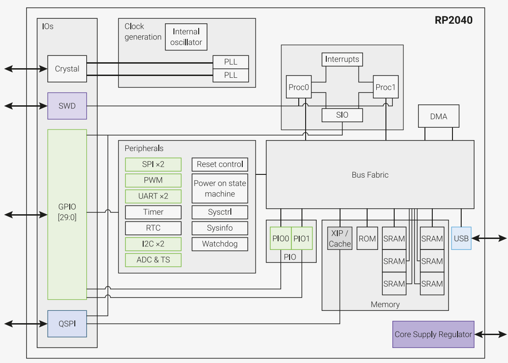
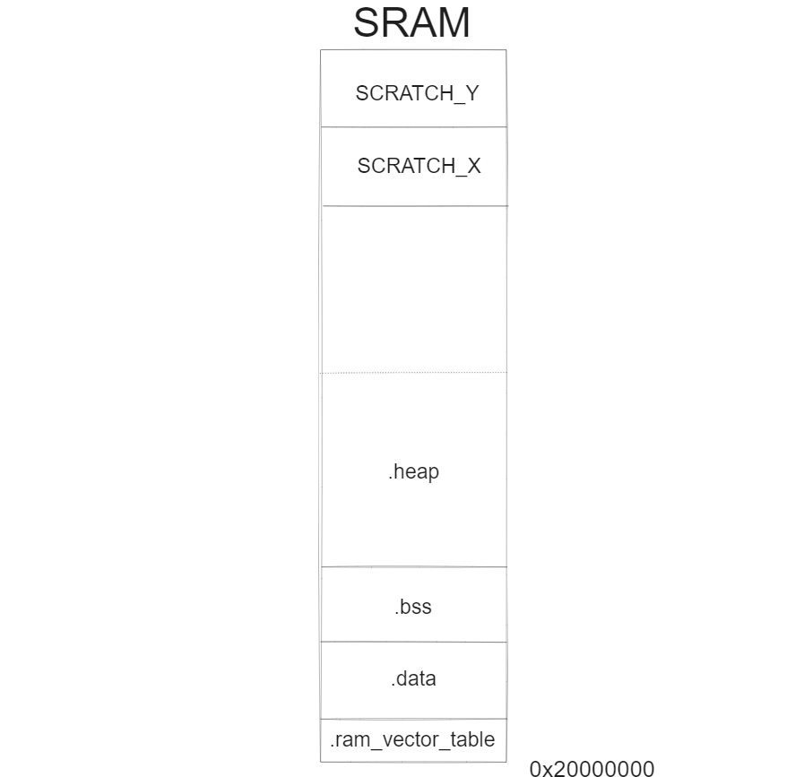
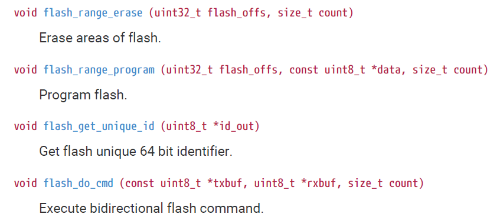

The purpose of this project is to understand how database systems work under the hood. I chose to use the Raspberry Pi Pico to work as close to baremetal as possible and to gain a deeper appreciation of embedded systems programming. The specific board being used is the Pico W. Code will be written in C using the C/C++ SDK (very helpful and detailed documentation found [here](https://www.raspberrypi.com/documentation/microcontrollers/c_sdk.html)). As a first step, this article covers reading and writing to the 2MiB of external flash memory on the board. This memory is the only non-volatile memory available to us and is also where the compiled executable lives. Below is a block diagram of the RP2040 chip:



What is most relevant to us from this diagram is that external flash memory is read through the QSPI, which (to the best of my understanding) allows for addressing a maximum of 16MiB of flash. Also pictured is the 264KiB SRAM, which is partitioned into six banks, four of which are 16Ki x 32-bit banks and two of which are 1Ki x 32-bit banks. The start of flash memory is mapped to address 0x10000000 and the start of SRAM is mapped to address 0x20000000 on the chip. A nice way to see this is to read through the "memmap_default.ld" linker script ([here](https://github.com/raspberrypi/pico-sdk/blob/master/src/rp2_common/pico_standard_link/memmap_default.ld) on github) in the SDK. While we will be using the default setup, others that allow for placing the executable entirely inside SRAM are available. Below is an excerpt:

```
MEMORY
{
    FLASH(rx) : ORIGIN = 0x10000000, LENGTH = 2048k
    RAM(rwx) : ORIGIN =  0x20000000, LENGTH = 256k
    SCRATCH_X(rwx) : ORIGIN = 0x20040000, LENGTH = 4k
    SCRATCH_Y(rwx) : ORIGIN = 0x20041000, LENGTH = 4k
}
```

The file goes on to detail where each segment of the compiled assembly should go. Specifically:

1. The .text segment, which is the code itself, should be stored in FLASH
2. The .data segment, which are all the initialised static and global variables, should be stored in RAM
3. The .bss segment, which apparently zeros out and stores uninitialised static and global variables, is then stored after .data in RAM
4. The .heap segment, which stores all dynamically allocated data, is stored after .bss in RAM. To the best of my understanding, the heap is allowed to grow towards higher memory addresses.
5. There are two stack segments for each of the cores. These are placed in SCRATCH_X and SCRATCH_Y. Core 0's stack is placed in SCRATCH_Y and core 1's stack is placed in SCRATCH_X. Note that core 0's stack, which is placed in SCRATCH_Y, is at a higher address than core 1's stack. This is because the stack grows towards smaller memory addresses, and if core 1 is not in use, then all the space reserved for it can be used by core 0's stack.

My understanding of SRAM organisation pictorially is:



Going back to flash memory, erasing can only be done in chunks of 4KiB and writing can only be done in chunks of 256 bytes. That is, "sector size" is 4096 bytes and "page size" is 256 bytes. The SDK provides functions to erase and program flash through its hardware/flash API:



To build the DBMS we would have to extensively utilise these. Note that to erase and program the flash memory, all interrupts on the board must be disabled prior to and can be re-enabled after. To get started, we now write a simple console application that stores user input, and if the user enters "print", it displays what was previously stored in that location. First we need a way to get user input. To do so, we can write a getLine() function as below:

```C
void getLine(char* buffer) {
    int i = 0;
    while(1) {
        char c = getchar();
        if(c != '\n' && c != '\r') {
            buffer[i++] = c;
        } else {
            break;
        }
    }
    buffer[i] = '\0';
}
```

Note that this is code is very unsafe as no checks are placed to ensure that user input fits within the buffer. However, this is just a trial program so good coding practices were, out of laziness, ignored. Now that we have the user input we need a function to parse user input:

```C
void processInput(char* buffer) {
    sleep_ms(10);
    printf("You input: %s\n",buffer);
    if(strcmp(buffer,"print") == 0) {
        char* retreived = retreiveFromMemory();
        sleep_ms(10);
        printf("Retrieved: %s\n",retreived);
        fflush(stdout);
    } else {
        sleep_ms(10);
        printf("Saving in memory...\n");
        saveInMemory(buffer);
    }
}
```

The 10ms sleeps before 'printf' are due to random behavior with the print buffers which even flushing didn't seem to fix. In the end, adding a small delay before the prints worked. Next we must define the retreiveFromMemory() and saveInMemory() functions:

```C
extern char __flash_binary_end;

void saveInMemory(char* string) {
    //Convert __flash_binary_end to integer pointer
    uintptr_t flashEndAddress = (uintptr_t)&__flash_binary_end;
    //Minimum addressable block is SECTOR_SIZE bytes wide.
    //To find the next suitable block, add SECTOR_SIZE to the end of
    //the binary and round down to the nearest block boundry
    uintptr_t nearestBlock = (flashEndAddress + SECTOR_SIZE) & 0xfffff000;
    //All hardware/fash functions work on offset.
    uint32_t offSet = nearestBlock - XIP_BASE;
    uint32_t ints = save_and_disable_interrupts();
    flash_range_erase(offSet,SECTOR_SIZE);
    flash_range_program(offSet, (const uint8_t*)string, SECTOR_SIZE);
    restore_interrupts (ints);
}
```

__flash_binary_end is a symbol that we use now that is later defined in the same linker script that we used to understand memory mapping. As the executable also lives in the flash memory, this to ensure that we do not corrupt it by overwriting sectors containing that data. The first two lines of the function find next 4KiB sector in flash. That is:

$$\text{Next block } = \left \lfloor \text{flashEndAddress } + 4096 \right \rfloor _ {4096}$$

Rounding to the nearest block boundary is done using a bitwise and with 0xfffff000: zeroing out any bits between 0-4095 ($16^3-1 = 4095$ ergo the last three digits of the hex). After obtaining the blocks to write to, save_and_disable_interrupts() of the hardware/sync API is used to temporarily disable interrupts before erasing and writing to flash. The interrupts are then re-enabled. Next we have the retreiveFromMemory() function:

```C
char* retreiveFromMemory() {
    uintptr_t flashEndAddress = (uintptr_t)&__flash_binary_end;
    uintptr_t nearestBlock = (flashEndAddress + SECTOR_SIZE) & 0xfffff000;
    sleep_ms(10);
    printf("Sector starts at: 0x%08x\n", nearestBlock);
    uint32_t ints = save_and_disable_interrupts();
    char* memoryLocation = (char*) nearestBlock;
    //Static to be able to return it
    static char staticBuffer[SECTOR_SIZE];
    printf("Static buffer created at: 0x%08x\n", &staticBuffer);
    memcpy(staticBuffer, memoryLocation, SECTOR_SIZE);
    restore_interrupts (ints);
    return staticBuffer;
}
```

To read from flash, the pointer is once again calculated. Data can be directly read like this. Just to illustrate SRAM organization, the function returns a static character array with the required data copied into it. Finally we have the main function and all the required headers:

```C
#include <stdlib.h>
#include "pico/stdlib.h"
#include "pico/cyw43_arch.h"
#include "hardware/flash.h"
#include "hardware/gpio.h"
#include "hardware/sync.h"

#define BUTTON 15
#define SECTOR_SIZE 4096

extern char __flash_binary_end;

void getLine(char* buffer);
void saveInMemory(char* string);
void processInput(char* buffer);
char* retreiveFromMemory();

int main() {
    stdio_init_all();
    if (cyw43_arch_init()) {
        printf("Wi-Fi init failed");
        return -1;
    }
    cyw43_arch_gpio_put(CYW43_WL_GPIO_LED_PIN, 1);
    uintptr_t end = (uintptr_t) &__flash_binary_end;
    gpio_init(BUTTON);
    gpio_set_dir(BUTTON, GPIO_IN);
    gpio_pull_up(BUTTON);
    while(gpio_get(BUTTON)) {
        ;
    }
    printf("Ends at 0x%08x \n\n",end);
    while(1) {
        sleep_ms(10);
        printf("Enter input: ");
        char buffer[SECTOR_SIZE] = {0};
        getLine(buffer);
        printf("Buffer created at: 0x%08x \n", &buffer);
        processInput(buffer);
        sleep_ms(10);
        printf("\n");
    }
}
```

The main function first turns on the onboard LED and then busy waits on a button press. This is to allow for time to open up the Putty terminal before the Pico outputs anything to stdout. Then the function enters a loop of accepting user input and responding accordingly. Now to build the code, we need to write a CMake file. This will correctly compile a makefile and everything else necessary as long as the SDK is downloaded and its path is included. We can then use 'make' to build the .uf2 executable. The CMakeFile used for this is:

```
cmake_minimum_required(VERSION 3.13)
include($ENV{PICO_SDK_PATH}/external/pico_sdk_import.cmake)

set(PICO_BOARD pico_w)

project(picoBlink)

pico_sdk_init()

add_executable(picoBlink
    main.c
)

target_link_libraries(picoBlink
        pico_cyw43_arch_none
        pico_stdlib
        hardware_flash
        hardware_gpio
        hardware_sync)

target_compile_options(picoBlink PRIVATE -fstack-usage)
target_compile_options(picoBlink PRIVATE -save-temps -fverbose-asm)

pico_enable_stdio_usb(picoBlink 1)
pico_enable_stdio_uart(picoBlink 0)

pico_add_extra_outputs(picoBlink)
```

Something very important I learned is that it is not enough to just enable input from the USB, you also need to disable UART input from sources other than through the USB. The code was also compiled with "-fstack-usage" to see the stack usage of each of the functions and with "-save-temps -fverbose-asm" to read through the generated assembly files. Now we can run the code. Below is some output from saving the string "abcd" to flash and printing it after: 

<!-- 

The program is given below:

```C
#include <stdlib.h>
#include "pico/stdlib.h"
#include "pico/cyw43_arch.h"
#include "hardware/flash.h"
#include "hardware/gpio.h"
#include "hardware/sync.h"

#define BUTTON 15
#define SECTOR_SIZE 4096

extern char __flash_binary_end;

void getLine(char* buffer);
void saveInMemory(char* string);
void processInput(char* buffer);
char* retreiveFromMemory();

int main() {
    stdio_init_all();
    if (cyw43_arch_init()) {
        printf("Wi-Fi init failed");
        return -1;
    }
    cyw43_arch_gpio_put(CYW43_WL_GPIO_LED_PIN, 1);
    uintptr_t end = (uintptr_t) &__flash_binary_end;
    gpio_init(BUTTON);
    gpio_set_dir(BUTTON, GPIO_IN);
    gpio_pull_up(BUTTON);
    while(gpio_get(BUTTON)) {
        ;
    }
    printf("Ends at 0x%08x \n\n",end);
    while(1) {
        sleep_ms(10);
        printf("Enter input: ");
        char buffer[SECTOR_SIZE] = {0};
        getLine(buffer);
        printf("Buffer created at: 0x%08x \n", &buffer);
        processInput(buffer);
        sleep_ms(10);
        printf("\n");
    }
}

void processInput(char* buffer) {
    sleep_ms(10);
    printf("You input: %s\n",buffer);
    if(strcmp(buffer,"print") == 0) {
        char* retreived = retreiveFromMemory();
        sleep_ms(10);
        printf("Retrieved: %s\n",retreived);
        fflush(stdout);
    } else {
        sleep_ms(10);
        printf("Saving in memory...\n");
        saveInMemory(buffer);
    }
}

void getLine(char* buffer) {
    int i = 0;
    while(1) {
        char c = getchar();
        if(c != '\n' && c != '\r') {
            buffer[i++] = c;
        } else {
            break;
        }
    }
    buffer[i] = '\0';
}

void saveInMemory(char* string) {
    //Convert __flash_binary_end to integer pointer
    uintptr_t flashEndAddress = (uintptr_t)&__flash_binary_end;
    //Minimum addressable block is SECTOR_SIZE bytes wide.
    //To find the next suitable block, add SECTOR_SIZE to the end of
    //the binary and round down to the nearest block boundry
    uintptr_t nearestBlock = (flashEndAddress + SECTOR_SIZE) & 0xfffff000;
    //All hardware/fash functions work on offset.
    uint32_t offSet = nearestBlock - XIP_BASE;
    uint32_t ints = save_and_disable_interrupts();
    flash_range_erase(offSet,SECTOR_SIZE);
    flash_range_program(offSet, (const uint8_t*)string, SECTOR_SIZE);
    restore_interrupts (ints);
}

char* retreiveFromMemory() {
    uintptr_t flashEndAddress = (uintptr_t)&__flash_binary_end;
    uintptr_t nearestBlock = (flashEndAddress + SECTOR_SIZE) & 0xfffff000;
    sleep_ms(10);
    printf("Sector starts at: 0x%08x\n", nearestBlock);
    uint32_t ints = save_and_disable_interrupts();
    char* memoryLocation = (char*) nearestBlock;
    //Static to be able to return it
    static char staticBuffer[SECTOR_SIZE];
    printf("Static buffer created at: 0x%08x\n", &staticBuffer);
    memcpy(staticBuffer, memoryLocation, SECTOR_SIZE);
    restore_interrupts (ints);
    return staticBuffer;
}
``` -->


<!-- ```C
#include <stdlib.h>
#include "pico/stdlib.h"
#include "pico/cyw43_arch.h"
#include "hardware/flash.h"
#include "hardware/gpio.h"
#include "hardware/sync.h"

#define BUTTON 15
#define SECTOR_SIZE 4096

extern char __flash_binary_end;

void getLine(char* buffer);
void saveInMemory(char* string);
void processInput(char* buffer);
char* retreiveFromMemory();

int main() {
    stdio_init_all();
    if (cyw43_arch_init()) {
        printf("Wi-Fi init failed");
        return -1;
    }
    cyw43_arch_gpio_put(CYW43_WL_GPIO_LED_PIN, 1);
    uintptr_t end = (uintptr_t) &__flash_binary_end;
    gpio_init(BUTTON);
    gpio_set_dir(BUTTON, GPIO_IN);
    gpio_pull_up(BUTTON);
    while(gpio_get(BUTTON)) {
        ;
    }
    printf("Ends at 0x%08x \n\n",end);
    while(1) {
	sleep_ms(10);
        printf("Enter input: ");
        char buffer[SECTOR_SIZE] = {0};
        getLine(buffer);
        processInput(buffer);
        sleep_ms(10);
        printf("\n");
    }
}

void processInput(char* buffer) {
    sleep_ms(10);
    printf("You input: %s\n",buffer);	
    if(strcmp(buffer,"print") == 0) {
        char* retreived = retreiveFromMemory();
        sleep_ms(10);
        printf("Retrieved: %s\n",retreived);
    } else {
        sleep_ms(10);
        printf("Saving in memory...\n");
        saveInMemory(buffer);
    }
}

void getLine(char* buffer) {
    int i = 0;
    while(1) {
        char c = getchar();
        if(c != '\n' && c != '\r') {
            buffer[i++] = c;    
        } else {
            break;
        }
    }
    buffer[i] = '\0';
}

void saveInMemory(char* string) {
    //Convert __flash_binary_end to integer pointer
    uintptr_t flashEndAddress = (uintptr_t)&__flash_binary_end;
    //Minimum addressable block is SECTOR_SIZE bytes wide. 
    //To find the next suitable block, add SECTOR_SIZE to the end of
    //the binary and round down to the nearest block boundry
    uintptr_t nearestBlock = (flashEndAddress + SECTOR_SIZE) & 0xfffff000;
    //All hardware/fash functions work on offset.
    uint32_t offSet = nearestBlock - XIP_BASE;
    uint32_t ints = save_and_disable_interrupts();
    flash_range_erase(offSet,SECTOR_SIZE);
    flash_range_program(offSet, (const uint8_t*)string, SECTOR_SIZE);
    restore_interrupts (ints);
}

char* retreiveFromMemory() {
    uintptr_t flashEndAddress = (uintptr_t)&__flash_binary_end;
    uintptr_t nearestBlock = (flashEndAddress + SECTOR_SIZE) & 0xfffff000;
    uint32_t ints = save_and_disable_interrupts();
    char* memoryLocation = (char*) nearestBlock;
    //Static to be able to return it
    static char staticBuffer[SECTOR_SIZE];
    memcpy(staticBuffer, memoryLocation, SECTOR_SIZE);
    restore_interrupts (ints);
    return staticBuffer;
}
``` -->


```terminal
Ends at 0x10044f38

Enter input: abcd
Buffer created at: 0x20040fd8
You input: abcd
Saving in memory...

Enter input: print
Buffer created at: 0x20040fd8
You input: print
Sector starts at: 0x10045000
Static buffer created at: 0x200030a4
Retrieved: abcd
```

From this we can see that the executable ends at 0x10044f38 and the nearest sector was 0x10045000. Another interesting thing the buffer created inside the main function is at location 0x20040fd8. This makes sense as it is within the stack region, but the stack is meant to start at 0x20042000 for core 0 by my understanding. Supposing that going towards higher memory addresses means going to higher index within the string, a 4KiB array would imply that the string ends at 0x20041fd8. There may possibly be other stuff on the stack from the API's used. Storing 4KiB on the stack is definitely not a good idea, as the stack is apparently only given 2KiB as evidenced by: 

```
spacer_section .stack

.p2align 5
    .equ StackSize, 0x800
.space StackSize
```

in a file called crt0.s, which seems in conflict with the 4KiB space reserved for SCRATCH_Y, unless the stack is allowed to grow past this size. As we have an entire 4KiB array on stack the latter seems reasonable. We also have that the static buffer is created at 0x200030a4 which makes sense as it would be stored within the .bss section. This seems to be confirmed by the line:

```
.section	.bss.staticBuffer.0,"aw",%nobits
```

inside the main.s assembly generated. 

From this groundwork we can now begin building the DBMS. Each 4KiB flash sector can be used as a page for the database. In the next article we will work on the fundamentals of the database with several simplifying assumptions to start with.