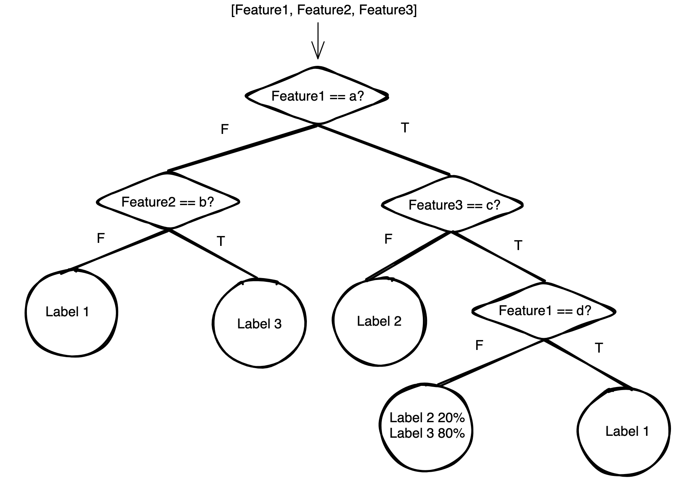
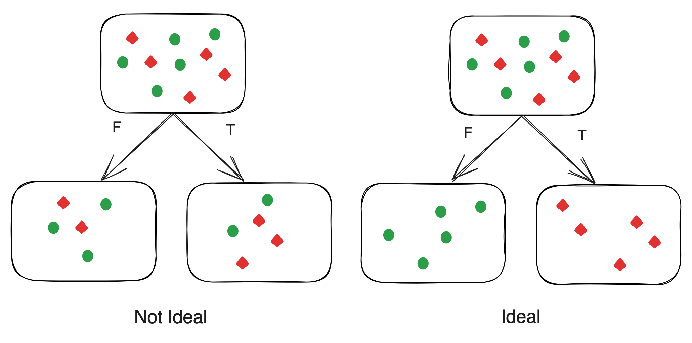
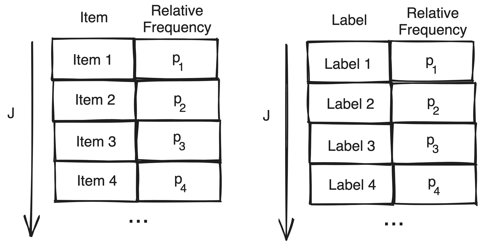
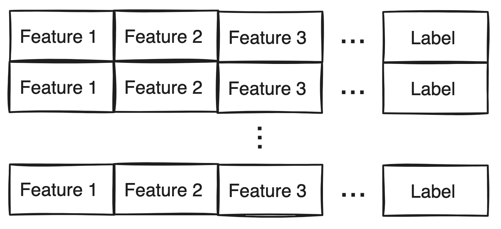

# What are decision trees?

Decision trees are a form of supervised machine learning. They are built on a binary tree data structure and generate predictions by percolating input features through a system of binary questions. All non-leaf nodes in the tree ask these questions and the leaf nodes contain predictions. The below illustration depicts a decision tree (specifically a classifier tree):



Decision trees are of two primary types: classification and regression. Loosely, classification trees output predictions with a discrete domain whereas regression trees output predictions with a continuous domain. For example, an algorithm to predict the fruit given a set of descriptors would be a classification algorithm whereas an algorithm to calculate the probability of post-operative complications would be a regression algorithm. 


# Problem:

Given training data as a set of $n$ tuples of the form:

$$\textbf{d} = \lbrace (\textbf{X}_i, L_i) | i \in [1,n] \rbrace$$

Where $\textbf{X}_i$ is a feature vector containing some $m$ features.

$$\textbf{X}_i = ( x_1, x_2, x_3,... x_m )$$

And $L_i$ is the label such that $L_i$ must have a discrete domain, the task is to generate a model $m(\textbf{X})$ that accurately predicts labels $\hat{L}$ based on an input feature vector $\textbf{X}$:

$$m(\textbf{X}) = \hat{L}$$

$m$ is an approximation of some true function $f$ that maps any feature vector to the correct label.

<!-- , and its existence is predicated based on the assumption that there exists such a $f$. -->

<!-- i.e. $L$ can only assume a state from a finite or countably infinite set,  -->

For the purposes of this article, the problem is further simplified by assuming that features cannot have ordering. That is, if weight is a feature, the question "Is weight $\le$ $x$ kg?" cannot be asked. Clearly this would stunt the algorithm's efficacy when dealing with numerical features. However, when it comes to non-numerical features, such questions would generally be meaningless. For example, if colour was a feature, the question "Is colour $\le$ green?" is meaningless. Hence, the purpose of this article is to create a simple classifier algorithm for data with non-numeric features. Specifically, a decision classifier tree of such specifications will be created.

# Strategy:

<!-- Redo:
The problem of creating a decision classifier tree boils down to one of asking the right questions in the right order such that the input dataset can be split down to pure leaf nodes. That is, to create a  -->

The decision classifier tree is effectively a dynamic questionnaire that yields a prediction at the end. It is dynamic in the sense that the next question asked depends on the answer of the current question. The set of questions and order in which they are asked deterministically depend on the values of the features.

When thinking in terms of the tree data structure, this property is equivalent to stating that: while traversal through the tree is a function of the input feature vector, the structure of the tree itself is fixed and generated in a manner such that the leaf nodes contain predictions. 

Given labelled training data, the set of questions that may be asked can easily be extracted (detailed in below sections). Hence, the problem of creating a decision classifier tree is one of finding the order in which to ask these questions. 

<!-- To be more clear, consider again the example classifier tree shown in the first section. Consider the below two possible set of questions that can be asked: That is, where structure of the tree itself is invariant, any path may be traversed through the tree. -->

<!-- Questions will be asked in an fixed order based on the   -->

Consider again the training data set $\textbf{d}$. Given that any boolean question partitions this data into two sets $\textbf{d}_T$ and $\textbf{d}_F$, and the goal is to create pure leaf nodes, it is intuitive that the optimal question to ask would be one that creates the purest split. That is, the question that generates $\textbf{d}_T$ and $\textbf{d}_F$ with the least mixing of labels must be asked. 



To be more concrete, this 'mixing' is quantified by Gini impurity index. We take a quick detour to derive this. Consider some dataset consisting of items marked by $J$ labels with relative frequencies $\left( \text{i.e.} \frac{\text{number of occurrences}}{\text{size of dataset}}\right)$ $p_i$ , $i \in [1,J]$. Gini impurity measures the probability that choosing an item at random and label at random from this dataset would yield an incorrect match. The items and labels are both identically distributed according to relative frequency, as visualized by the below illustration:



Clearly, the likelihood of correctly matching the $\text{item}_i$ and $\text{label}_i$ would be:

$$P(\text{Matching}_i) = P(\text{Picking item}_i) \text{ and } P(\text{Picking label}_i)$$

(Note: Matching $\text{}_i$ is shorthand for "Matching label $\text{}_i$ with item $\text{}_i$")

By probability theory:

$$P(\text{Matching}_i) = P(\text{Picking item}_i) \times P(\text{Picking label}_i)$$

Probability of picking the correct item would be its relative frequency $p_i$. Moreover, as the items and labels are identically distributed, the probability of picking the correct label would also be $p_i$.

$$ P(\text{Matching}_i) =  p_i \times p_i$$

$$ P(\text{Matching}_i) =  p_i^2$$

Now, the the probability of correctly matching any label with its corresponding item can be written as:

$$P(\text{Matching}) =  P(\text{Matching}_1) \text{ or } P(\text{Matching}_2) \text{ or } ... \text{ } P(\text{Matching}_J)$$

By probability theory:

$$P(\text{Matching}) =  P(\text{Matching}_1) + P(\text{Matching}_2) + ... \text{ } P(\text{Matching}_J)$$

In summation notation:

$$P(\text{Matching}) =  \sum_{i=1}^{J} P(\text{Matching}_i)$$

From earlier derivation,

$$P(\text{Matching}) =  \sum_{i=1}^{J} p_i^2$$

Now consider the probability of an incorrect match. As matching and not matching are mutually exclusive and exhaustive,

$$P(\text{Matching}) + P(\text{Not Matching}) = 1$$

$$P(\text{Not Matching}) = 1 - P(\text{Matching})$$

From earlier derivation,

$$P(\text{Not Matching}) = 1 - \sum_{i=1}^{J} p_i^2$$

As the Gini impurity $G$ measures the probability that choosing an item at random and label at random would yield an incorrect match,

$$G = 1 - \sum_{i=1}^{J} p_i^2$$

Hence, a question that splits the dataset $\textbf{d}$ such that the Gini impurity of $\textbf{d}_T$ and $\textbf{d}_F$ are minimized must be asked. The below weighted average is used as this measure:

$$I = \frac{|\textbf{d}_T|}{|\textbf{d}|}G(\textbf{d}_T) + \frac{|\textbf{d}_F|}{|\textbf{d}|}G(\textbf{d}_F)$$

A weighted average is used to account for size. A split that creates a pure but small $\textbf{d}_T$ or $\textbf{d}_F$ should be a weaker question than a split that creates a relatively less pure but larger $\textbf{d}_T$ and $\textbf{d}_F$.

Another key factor to consider is the impurity of the parent dataset. If a question generating the lowest impurity splits $\textbf{d}$ such that $I$ is less than $G(\textbf{d})$, then asking this question is detrimental. Hence, the quantity used to measure question efficacy is:

$$\text{Gain} = | G(\textbf{d}) - I(\textbf{d}_T,\textbf{d}_F) |$$

Based on all of the above, the strategy for generating the decision classifier tree's structure becomes evident. Consider starting by creating the head node of the tree. The head node must contain the question that best splits input training dataset $\textbf{d}$. To find this question, a simple method would be to iterate over all possible questions that can be asked and calculate the corresponding $\text{Gain}$, and then choose the question that generates the largest of these values. To create pure leaf nodes, the above process of splitting the input dataset into purer subsets must be carried out again if $\textbf{d}_T$ or $\textbf{d}_F$ are impure. Moreover, this process must be continued until the leaf nodes are pure, no more questions can be asked, or if further partitioning would lead to loss of information.  Succinctly: recursive partitioning.
<!-- As this minimizes impurity of the child nodes, iterative application will minimize the height of the tree. Next comes the issue of the child nodes.  -->

<!-- Given a label $i$, probability of assigning the correct item to that label would be the relative frequency of the item with that label: $p_i$. -->

# Implementation:

All code can be found [here](https://github.com/AbhinavPradeep/DecisionTreeClassifierFromScratch). It is assumed that training data will be provided as an array of the form:



## Question class

A key component of the decision classier tree is the concept of a question. Under the simplifications made for this article, a question is of the form:

$$\text{Feature == Value?}$$

Hence, it can be completely described by two variables: the feature and the value. Feature is stored as its position in the feature vector. Pythons dynamic typing allows the attribute's type to be determined at runtime. The question class also captures the labelling process by considering it as the question $\text{Label == Value?}$. As the label was assumed to be stored in the last index of the feature tuple, the CheckCondition function can detect if feature being checked is the label, and then call the AssignLabel function. Having CheckCondition call AssignValue was done for convince sake and is probably not best principles.

```python
class Question:
    def __init__(self,Attribute,Condition) -> None:
        self.Attribute = Attribute
        self.Condition = Condition

    def CheckCondition(self,Row:list):
        if self.Attribute == -1:
            self.AssignLabel(Row)
            return
        if Row[self.Attribute] == self.Condition:
            return True
        else:
            return False
        
    def AssignLabel(self,Row:list):
        Row[self.Attribute] = self.Condition

    def __str__(self) -> str:
        return f"Is Row[{self.Attribute}] == {self.Condition}?"
    
    __repr__ = __str__
```

## Node class

The below is a regular node class used in the tree data structure. It has a question object and a pointer to its left and right nodes:

```python
from Question import Question

class Node:
    def __init__(self,Question:Question=None,LeftNode=None,RightNode=None) -> None:
        self.Question = Question
        self.LeftNode = LeftNode
        self.RightNode = RightNode

    def __str__(self) -> str:
        return str(self.Question)
    
    __repr__ = __str__
```

## DecisionTreeClassifier class

### Helper methods

The below is an implementation of the Gini impurity function:

$$G = 1 - \sum_{i=1}^{J} p_i^2$$

To calculate relative frequency $p_i$ the collections package is used. This package was used to address a bottleneck that significantly slowed time taken to train the model. The naive approach which caused this bottleneck is commented out.

```python
def CalculateImpurity(self,Labels: list):
    UniqueLabels = []
    UniqueLabels = collections.Counter(Labels)
    UniqueLabels = list(UniqueLabels.items())
    #for Label in Labels:
    #   if (Label, Labels.count(Label)) not in UniqueLabels:
    #       UniqueLabels.append((Label, Labels.count(Label)))
    Impurity = 1-(sum([(j/(len(Labels)))**2 for i, j in UniqueLabels]))
    print(Impurity)
    return Impurity
```

The below is a straightforward implementation of the weighted average impurity function:

$$I = \frac{|\textbf{d}_T|}{|\textbf{d}|}G(\textbf{d}_T) + \frac{|\textbf{d}_F|}{|\textbf{d}|}G(\textbf{d}_F)$$

```python
def CalculateAverageImpurity(self,Labels1, Labels2):
    AverageImpurity = abs(((len(Labels1)/(len(Labels1)+len(Labels2)))*self.CalculateImpurity(
        Labels1))+((len(Labels2)/(len(Labels1)+len(Labels2)))*self.CalculateImpurity(Labels2)))
    return AverageImpurity
```

The below is a straightforward implementation of the gain function:

$$\text{Gain} = | G(\textbf{d}) - I(\textbf{d}_T,\textbf{d}_F) |$$

```python
def CalculateGain(self,Parent, Labels1, Labels2):
    InformationGain = abs(self.CalculateImpurity(
        Parent)-self.CalculateAverageImpurity(Labels1, Labels2))
    return InformationGain
```

The below function is used to handle the cases that, given some impure dataset, no question can generate any information gain or there exist no more questions that can be asked. This is done by reporting all possible labels and the associated probability that the input feature vector can be mapped to that label. Returns a list of tuples containing the label and its associated relative frequency in the impure dataset. 

```python
def GenerateProbability(self, Labels: list):
    LabelsAndProbability = []
    for Label in Labels:
        if (Label, Labels.count(Label)) not in LabelsAndProbability:
            LabelsAndProbability.append(
                (Label, (Labels.count(Label))/len(Labels)))
    return LabelsAndProbability
```

### BuildTree method
<!-- 
: simply generate the set of all unique pairs [Feature, Value]. Consider the below table of training data:

It is clear that the questions  -->
BuildTree is a recursive function that builds a decision tree from any input training data that adheres to the previously discussed format. The function returns the root of the decision tree. Below is a sketch of how the function works:

1. Create a new node: A new instance of the Node class is created.

2. Generate all possible questions: For each feature-value pair in the data table, a Question object is created.

3. Calculate the effectiveness of each question: For each question, calculate the gain produced.

4. Check if a 'best question' exists: If no question has positive gain, a leaf node is created with all possible labels and their associated probability. Else, the question with the highest gain is chosen. 

5. Split the data and issue recursive call: The data is split based on the best question. Each subset of the data is used to create a new branch of the tree. If the data in a branch is pure (all labels are the same), a leaf node is created. Otherwise, the function is called recursively to create a new subtree.

```python
def BuildTree(self, DataTable: list[list]) -> Node:
    NewNode = Node()
    Attributes = []
    for x in DataTable:
        for i, j in enumerate(x[0:-1]):
            if (i, j) not in Attributes:
                Attributes.append((i, j))
    Questions = [Question(i, j) for (i, j) in Attributes]
    Labels = [x[-1] for x in DataTable]
    QuestionEffectiveness = []
    for Q in Questions:
        TrueLabels = []
        TrueIndices = []
        FalseLabels = []
        FalseIndices = []
        i = 0
        for Row in DataTable:
            if Q.CheckCondition(Row) == True:
                TrueLabels.append(Row[-1])
                TrueIndices.append(i)
            else:
                FalseLabels.append(Row[-1])
                FalseIndices.append(i)
            i += 1
        Gain = self.CalculateGain(Labels, TrueLabels, FalseLabels)
        QuestionEffectiveness.append(
            (Q, Gain, TrueLabels, FalseLabels, TrueIndices, FalseIndices))
    if max(QuestionEffectiveness, key=itemgetter(1))[1] == 0:
        FinalQuestion = Question(-1, self.GenerateProbability(Labels))
        return Node(FinalQuestion)
    BestQuestion = max(QuestionEffectiveness, key=itemgetter(1))
    print(BestQuestion[0])
    NewNode.Question = BestQuestion[0]
    TrueLabels = BestQuestion[2]
    FalseLabels = BestQuestion[3]
    # True goes right
    if self.CalculateImpurity(TrueLabels) == 0:
        FinalQuestion = Question(-1, TrueLabels[0])
        NewNode.RightNode = Node(FinalQuestion)
    else:
        TrueRows = [DataTable[i] for i in BestQuestion[4]]
        NewNode.RightNode = self.BuildTree(TrueRows)
    # False goes left
    if self.CalculateImpurity(FalseLabels) == 0:
        FinalQuestion = Question(-1, FalseLabels[0])
        NewNode.LeftNode = Node(FinalQuestion)
    else:
        FalseRows = [DataTable[i] for i in BestQuestion[5]]
        NewNode.LeftNode = self.BuildTree(FalseRows)
    return NewNode
```

# Training

Training data was taken from [here](https://archive.ics.uci.edu/dataset/73/mushroom). The dataset contains data on species of edible and poisonous mushrooms. The first 800 rows of data were removed for testing purposes. The below code takes the remaining, imports it, formats it, generates a decision classifier tree from it and pickles the object for testing:

```python
from Node import Node
from DecisionTreeClassifier import DecisionTreeClassifier
import pickle

import csv

with open('shrooms.csv', newline='') as f:
    reader = csv.reader(f)
    data = list(reader)

FormattedData = []
for Row in data:
    Row.append(Row.pop(0))
    Row.pop(4)
    FormattedData.append(Row)

Classifier = DecisionTreeClassifier()

Tree = Classifier.BuildTree(FormattedData)

with open('ShroomTree.pkl', 'wb') as f:
     pickle.dump(Tree, f)
f.close()
```

# Testing

The below code unpacks the previously pickled tree object and tests it against the first 800 rows of data that were initially removed:

```python
from Node import Node
from DecisionTreeClassifier import DecisionTreeClassifier
from Question import Question
import pickle
import csv
import collections

with open('ShroomTree.pkl', 'rb') as f:
    Tree = pickle.load(f)
f.close()

with open('testdata.csv', newline='') as f:
    reader = csv.reader(f)
    data = list(reader)

FormattedData = []
for Row in data:
    Row.append(Row.pop(0))
    Row.pop(4)
    FormattedData.append(Row)

with open('testdata.csv', newline='') as f:
    reader = csv.reader(f)
    data = list(reader)

LabelsRemoved=[]
for Row in data:
    Row.append(Row.pop(0))
    Row.pop(4)
    Row[-1]=None
    LabelsRemoved.append(Row)

def printTree(node:Node, level=0):
    if node != None:
        printTree(node.LeftNode, level + 1)
        print(' ' * 4 * level + '-> ' + f"{node}")
        printTree(node.RightNode, level + 1)

def AssignLabels(TableOFData : list[list],Tree: Node):
    for Row in TableOFData:
        CurrentNode = Tree
        Labelled = False
        while Labelled == False:
            Result = CurrentNode.Question.CheckCondition(Row)
            if Result == None:
                Labelled = True
            elif Result == True:
                CurrentNode = CurrentNode.RightNode
            elif Result == False:
                CurrentNode = CurrentNode.LeftNode

printTree(Tree)

AssignLabels(LabelsRemoved,Tree)

def CheckLabels(Data,DataLabelsRemoved):
    BoolList =[]
    for i,j in enumerate(Data):
        BoolList.append(j == DataLabelsRemoved[i])
    FreqList = collections.Counter(BoolList)
    FreqList = list(FreqList.items())
    print(FreqList)
    print(f"{(FreqList[0][1]/(FreqList[1][1]+FreqList[0][1]))*100}%")
    

CheckLabels(FormattedData,LabelsRemoved)
```
# Result:

It is evident that even a highly simplified implementation is fairly accurate. Note however that the large volume of training data and the fact that there were only two possible labels to be assigned definitely have some impact on the accuracy. 

```
                                    -> Is Row[-1] == p?
                                -> Is Row[7] == w?
                                        -> Is Row[-1] == e?
                                    -> Is Row[8] == e?
                                        -> Is Row[-1] == p?
                            -> Is Row[2] == y?
                                    -> Is Row[-1] == p?
                                -> Is Row[1] == s?
                                    -> Is Row[-1] == e?
                        -> Is Row[1] == f?
                                -> Is Row[-1] == e?
                            -> Is Row[0] == x?
                                        -> Is Row[-1] == p?
                                    -> Is Row[3] == t?
                                        -> Is Row[-1] == e?
                                -> Is Row[9] == e?
                                    -> Is Row[-1] == e?
                    -> Is Row[19] == y?
                        -> Is Row[-1] == e?
                -> Is Row[18] == u?
                    -> Is Row[-1] == e?
            -> Is Row[13] == n?
                -> Is Row[-1] == e?
        -> Is Row[11] == f?
            -> Is Row[-1] == e?
    -> Is Row[6] == b?
                -> Is Row[-1] == e?
            -> Is Row[18] == r?
                -> Is Row[-1] == p?
        -> Is Row[18] == h?
            -> Is Row[-1] == p?
-> Is Row[10] == k?
        -> Is Row[-1] == e?
    -> Is Row[5] == c?
        -> Is Row[-1] == p?
[(True, 792), (False, 8)]
99.0%
```